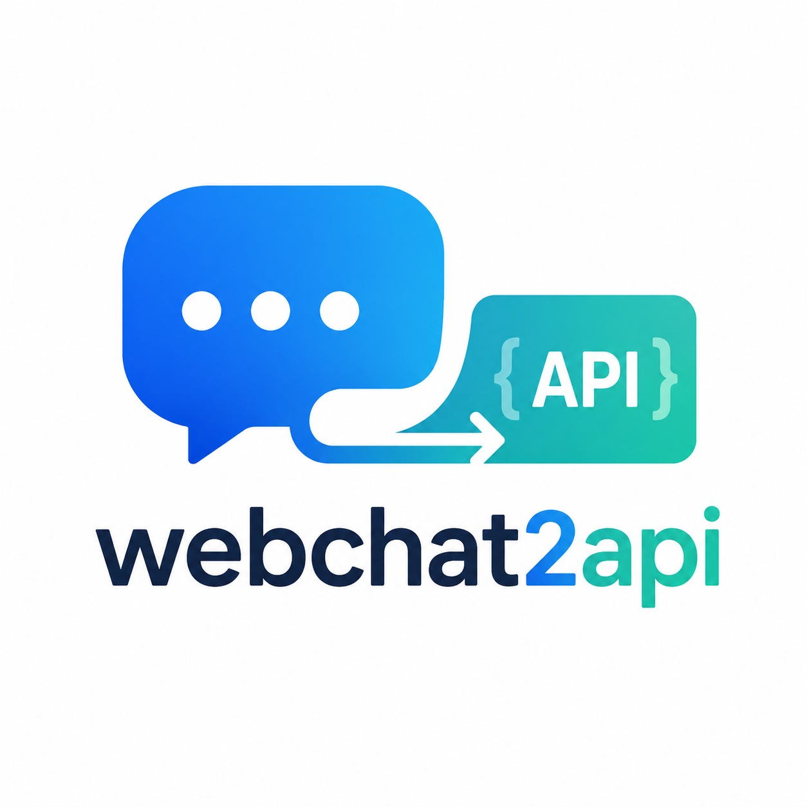
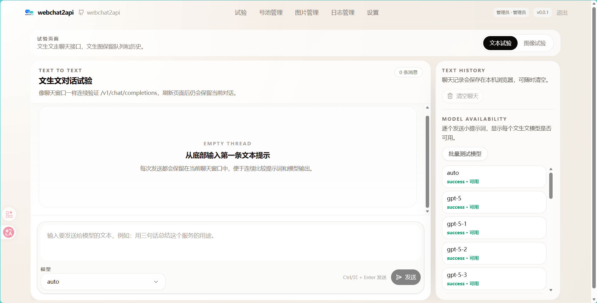
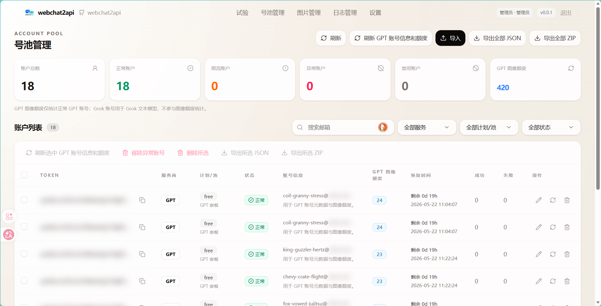

<h1 align="center">webchat2api</h1>

<p align="center">
  
</p>

<p align="center">webchat2api 是一个将 GPT/ChatGPT Web 与 Grok/xAI Web 能力封装为标准 API 接口的代理服务项目，提供 FastAPI 后端、Next.js Web 管理端、OpenAI 风格 API、GPT/Grok 账号池管理、文生文/文生图试验页以及 Docker 自托管部署能力。</p>

> [!WARNING]
> 免责声明：本项目涉及对 GPT/ChatGPT Web 与 Grok/xAI Web 能力的逆向研究与封装，仅供个人学习、技术研究与非商业性技术交流使用。严禁用于商业倒卖、批量滥用、违反服务条款或违法违规场景。使用者需自行承担账号受限、封禁及其他法律与合规风险。

> [!IMPORTANT]
> 默认登录密钥为 `admin`，仅适合本地测试。公网或生产环境部署后必须通过 `LOGIN_SECRET` 或 `WEBCHAT2API_AUTH_KEY` 修改为强随机密钥。

## 功能概览

- OpenAI 风格 API：将 GPT/ChatGPT Web 与 Grok/xAI Web 能力包装为 `/v1/models`、`/v1/chat/completions`、`/v1/images/generations`、`/v1/images/edits`、`/v1/responses`、`/v1/messages` 等接口
- GPT/Grok 文本模型：`/v1/models` 优先通过 `provider=gpt` 账号动态拉取 GPT 模型，并合并静态 Grok 模型；`/v1/chat/completions` 按 `model` 自动分发到 GPT 或 Grok 服务商账号
- Web 管理后台：账号池、用户 API Key、代理、日志、图片任务、图片文件和系统配置管理
- 账号服务商：账号 `provider` 选择 `gpt` 或 `grok`，账号 `type` 仍表示套餐或订阅类型
- 试验页：文生文聊天、文本模型批量可用性测试、文生图/图生图切换、图片队列和图片历史
- 文生文聊天历史：保存在浏览器本地，刷新页面后仍保留
- 图片账号轮换：图片生成/编辑遇到失效账号时，会跳过该账号并尝试下一个可用账号
- 账号导出：支持 JSON/ZIP，access-token-only 账号也可导出，缺失字段输出为空字符串
- 部署方式：Docker CLI、Docker Compose

## 界面预览

<p align="center">
  
</p>

<p align="center">
  
</p>

## 快速开始

### Docker CLI 部署

```bash
docker build -t webchat2api:latest .

docker run -d \
  --name webchat2api \
  --restart unless-stopped \
  -p 83:83 \
  -v $(pwd)/data:/app/data \
  -e PORT=83 \
  -e HOST=0.0.0.0 \
  -e LOGIN_SECRET=admin \
  webchat2api:latest
```

如需容器访问宿主机代理：

```bash
docker run -d \
  --name webchat2api \
  --restart unless-stopped \
  --add-host=host.docker.internal:host-gateway \
  -p 83:83 \
  -v $(pwd)/data:/app/data \
  -e PORT=83 \
  -e HOST=0.0.0.0 \
  -e LOGIN_SECRET=admin \
  -e PROXY_URL=http://host.docker.internal:7890 \
  webchat2api:latest
```

部署后访问：

- 服务地址：`http://localhost:83`
- 管理后台：`http://localhost:83`
- API Base URL：`http://localhost:83/v1`
- 默认登录密钥：`admin`

生产环境请立即修改默认密钥：

```bash
docker run -d \
  --name webchat2api \
  --restart unless-stopped \
  -p 83:83 \
  -v $(pwd)/data:/app/data \
  -e LOGIN_SECRET=your-strong-secret \
  webchat2api:latest
```

### Docker Compose 部署

```bash
docker compose up -d
```

常用命令：

```bash
docker logs -f webchat2api
docker restart webchat2api
docker compose down
```

### 本地开发

启动后端：

```bash
uv sync
LOGIN_SECRET=admin uv run python main.py
```

启动前端开发服务：

```bash
cd web
npm install
npm run dev
```

## API 示例

所有 AI 接口均使用 Bearer Token 鉴权：

```http
Authorization: Bearer <LOGIN_SECRET 或用户 API Key>
```

健康检查：

```bash
curl http://localhost:83/health
```

返回：

```json
{"status":"ok"}
```

模型列表：

```bash
curl http://localhost:83/v1/models \
  -H "Authorization: Bearer admin"
```

`/v1/models` 会优先使用已导入的 `provider=gpt` 账号动态拉取 GPT 模型；如果没有可用 GPT 账号或拉取失败，会回退到匿名/内置 GPT 模型。Grok 当前使用内置模型列表，因为现有 Grok token/cookie 无法访问 `console.x.ai` 或 `api.x.ai` 的模型列表端点。Grok 示例模型包括 `grok-4.3`、`grok-4`、`grok-4.20`、`grok-4.20-reasoning`、`grok-4.20-non-reasoning`、`grok-4.20-multi-agent`。

聊天接口：

```bash
curl http://localhost:83/v1/chat/completions \
  -H "Content-Type: application/json" \
  -H "Authorization: Bearer admin" \
  -d '{
    "model": "auto",
    "messages": [
      {"role": "user", "content": "你好"}
    ]
  }'
```

也可直接选择 Grok 模型，接口会按模型分发到 `provider=grok` 的账号：

```bash
curl http://localhost:83/v1/chat/completions \
  -H "Content-Type: application/json" \
  -H "Authorization: Bearer admin" \
  -d '{
    "model": "grok-4.3",
    "messages": [
      {"role": "user", "content": "你好"}
    ]
  }'
```

图片生成接口：

```bash
curl http://localhost:83/v1/images/generations \
  -H "Content-Type: application/json" \
  -H "Authorization: Bearer admin" \
  -d '{
    "model": "gpt-image-2",
    "prompt": "一只漂浮在太空里的猫",
    "n": 1,
    "response_format": "b64_json"
  }'
```

ChatGPT 图片生成/编辑仍只使用 GPT 服务商账号，不声明 Grok 图片能力。

账号导入说明：

导入 GPT 账号时使用 `provider=gpt` 或保持默认；导入 Grok 账号 token/cookie 时使用 `provider=grok`。`provider` 负责选择服务商，`type` 仍用于记录 plan、subscription 等套餐或订阅类型。

账号导出接口：

```bash
curl http://localhost:83/api/accounts/export \
  -H "Content-Type: application/json" \
  -H "Authorization: Bearer admin" \
  -d '{
    "format": "json",
    "access_tokens": []
  }'
```

`access_tokens` 为空数组时导出全部账号；仅有 `access_token` 的账号也会导出。

## 配置

核心配置见 `.env.example`、`config.example.json` 和 [技术指南](./docs/technical-guide.md)。如需本地覆盖配置，请复制示例文件：

```bash
cp config.example.json config.json
```

`config.json` 是本地运行配置，可能包含代理、备份密钥或其他敏感值，不应提交。`data/` 保存账号、用户密钥、日志、图片任务等运行数据，必须保持本地忽略，永远不要提交到代码仓库。

| 配置项 | 默认值 | 说明 |
| --- | --- | --- |
| `PORT` | `83` | 服务监听端口 |
| `HOST` | `0.0.0.0` | 服务监听地址 |
| `LOGIN_SECRET` | `admin` | 管理后台默认登录密钥 |
| `WEBCHAT2API_AUTH_KEY` | 空 | 兼容旧配置的登录密钥覆盖项 |
| `WEBCHAT2API_BASE_URL` | 空 | 生成图片访问 URL 时使用的外部基础地址 |
| `PROXY_URL` | 空 | 上游请求使用的 HTTP/HTTPS/SOCKS 代理 |
| `STORAGE_BACKEND` | `json` | 存储后端：`json`、`sqlite`、`postgres`、`git` |
| `DATABASE_URL` | 空 | SQLite/PostgreSQL 连接字符串 |
| `GIT_REPO_URL` | 空 | Git 存储后端仓库地址 |
| `GIT_TOKEN` | 空 | Git 存储后端访问令牌 |

## 文档

完整技术指南见：[docs/technical-guide.md](./docs/technical-guide.md)。

功能状态见：[docs/feature-status.md](./docs/feature-status.md)。

上游 SSE 会话协议参考见：[docs/upstream-sse-conversation.md](./docs/upstream-sse-conversation.md)。

## 版本

当前版本：`0.0.1`

## 致谢

感谢 https://github.com/chenyme/grok2api 和 https://github.com/basketikun/chatgpt2api。
